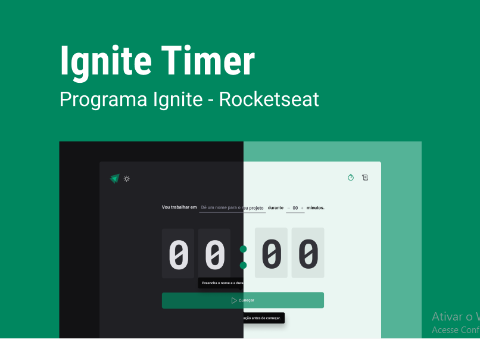

# Ignite Feed




Projeto construído no curso ignite da rockeatseat, é um tipo de pomodoro onde você da um nome a um projeto, e o tempo que irá trabalhar nele.

## Para usá-lo:

### Clone o repositório

```git clone https://github.com/KlevissonWeskley/igniteTimer.git```

### Instale as dependências

```npm install```

### Rode o projeto

```npm run dev```

## 🛠 Tecnologias

- React 
- TS
- Git e Github

## 💛 Contato

klevissonweskley13@gmail.com